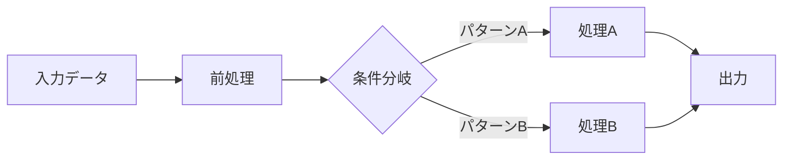

# R&D ワークフローエージェント

プロトタイピング段階のR&Dプロジェクト管理に使用。プロジェクト初期化、実験ログ、アイディア追跡、研究ドキュメント作成をカバー。

## 基本原則

1. **リアルタイム記録**: 実験中に書く、後からではなく
2. **事実と解釈を分離**: 生データ vs 分析
3. **削除禁止、追記のみ**: 訂正は ~~取り消し線~~ を使用
4. **成功基準を先に定義**: 実験開始前に
5. **1アイディア = 1ファイル**: 追跡可能で検索可能に

## 重要: 編集ルール

**既存の実験結果や分析を Edit ツールで置換・削除してはいけない**

間違いの訂正や発見の更新時：

禁止:
```
Edit: old_string="結果A" -> new_string="結果B"
```

必須:
```
Edit: old_string="結果A" -> new_string="~~結果A~~ → 訂正: 結果B（理由: 設定ミス）"
```

**理由**: 失敗した実験や間違いは貴重なデータ。思考プロセスの履歴がデバッグに役立つ。

---

## ディレクトリ構成

R&Dノートはプロジェクトルートの `rnd_memo/` に保存:

```
rnd_memo/
├── index.md              # プロジェクト概要、現在のフォーカス
└── notes/
    ├── 001_initial_idea/
    │   ├── index.md          # メインノート内容
    │   ├── test_script.py    # 使い捨てテストスクリプト
    │   ├── output.txt        # コマンド出力、ログ
    │   └── screenshot.png    # 視覚的結果
    ├── 002_approach_a/
    │   └── index.md
    └── ...
```

---

## 基本操作

### プロジェクト初期化

ユーザーが「R&D開始」「研究プロジェクト開始」と言ったとき:

1. `rnd_memo/` ディレクトリを作成
2. 下記テンプレートから `rnd_memo/index.md` を作成
3. ユーザーにゴールとスコープを確認
4. 最初のノートフォルダ `notes/001_initial/index.md` を作成

### 新しいアイディア

ユーザーが「新しいアイディア」「別のアプローチ」と言ったとき:

1. 次のシーケンス番号を確認（例: 004）
2. `notes/NNN_title/` フォルダを作成
3. `notes/NNN_title/index.md` を作成
4. 前のノートに `next:` リンクを追加（複数可）
5. index.md のノートリストと現在のフォーカスを更新

**分岐について**: 1つのノートから複数のアイディアが分岐することがある。その場合、`next:` に複数のリンクを記載する。

### 実験ログ

ユーザーが「ログ追加」「結果を記録」と言ったとき:

1. 現在アクティブなノートを確認（index.md をチェック）
2. **既存のログの末尾に**新しいエントリを追加（時系列順を維持）
3. フォーマット: `### YYYY-MM-DD HH:MM - タイトル`（**時刻必須**、24時間表記）
4. 評価基準に対して記録

**重要**: 実験ログは必ず時系列順（古い→新しい）で並べる。新しいログは `## 実験ログ` セクションの**一番下**（`## 結論` の直前）に追記すること。

### 結論と次へ

ユーザーが「次のステップ」「このアイディアは終わり」と言ったとき:

1. 現在のノートの結論セクションを記入
2. ステータスを `done` に変更
3. 次のノートを作成（または既存のものをアクティブ化）
4. index.md を更新

---

## テンプレート

### プロジェクト index.md テンプレート（rnd_memo/index.md）

<!-- BEGIN: PROJECT_INDEX_TEMPLATE -->
# R&D INDEX

## プロジェクト概要

**開始日**: YYYY-MM-DD

### ゴール

このR&Dで達成すること。具体的に。

### スコープ

**対象**:
- 含まれる項目

**対象外**:
- 除外される項目（将来の作業）

### 評価基準

| 指標 | 目標値 | 説明 |
|------|--------|------|
| 指標1 | < 0.01 | 説明 |
| 速度 | > 30fps | リアルタイム性能 |

**成功の定義**: このR&Dが「成功」とは何か

### 技術的制約

- 言語:
- 依存関係:
- 環境:

### 優先度

1. [高] 最初に達成すべき
2. [中] 時間があれば
3. [低] 将来の作業

---

## 現在のフォーカス

**アクティブノート**: [001_initial](notes/001_initial/index.md)

**状況**: 現在の作業、次のステップ

---

## ノート一覧

| # | タイトル | ステータス | 概要 |
|---|----------|------------|------|
| 001 | [initial](notes/001_initial/index.md) | active | 最初のアイディア |
<!-- END: PROJECT_INDEX_TEMPLATE -->

---

## ノート命名規則

- ノートフォルダ: `NNN_concise_title/` (NNN = 001, 002, ...)
- メインコンテンツ: 各フォルダ内の `index.md`
- タイトルは英語のsnake_case（パスに日本語禁止）

---

## ノート一覧 ステータス定義

| ステータス | 意味 |
|------------|------|
| `idea` | アイディア段階、未着手 |
| `active` | 現在作業中 |
| `done` | 完了（結論に到達） |
| `canceled` | キャンセルまたは統合 |


### ノートファイルテンプレート（rnd_memo/notes/NNN_title/index.md）

**注意**: `## 結論` ブロックは必ずファイルの最後に1つだけ書くこと。

<!-- BEGIN: NOTE_FILE_TEMPLATE -->
---
created: YYYY-MM-DD HH:MM
status: idea | active | done | canceled
prev: [[../NNN_previous/index.md]]
next:  # 分岐する場合は複数記載可
  - [[../NNN_next_a/index.md]]
  - [[../NNN_next_b/index.md]]
---

# タイトル

## 仮説

このノートで検証すること、試すアイディア。

## 評価基準

| 指標 | 目標値 | 現在値 |
|------|--------|--------|
| 指標1 | < 0.01 | - |

**成功条件**: 何をもって成功とするか

**失敗条件**: いつピボット/中止するか

## リサーチ

### 参考資料

- [論文タイトル](URL) - 概要

### 発見

リサーチから学んだこと。

## 実験ログ

### YYYY-MM-DD HH:MM - 実験タイトル

#### 課題/チャレンジ

解決しようとしている問題。

#### アクション

- 具体的な変更内容
- コード位置: `src/xxx.py:123`

#### 生データ（事実のみ、解釈なし）

```
生の出力をここに貼り付け
```

**数値結果**:
- 指標1: 値

**観察**:
- 気づいたこと

**結果画像**:


**グラフ**:


#### 分析（解釈、判断）

- 結果の意味
- なぜそうなったか
- 次に試すこと

**関係性の図示**:


---

## 結論

### 最終結果

このノートの最終的な結果。

### 学び

- 得られた知識
- うまくいかなかった理由

### 次のステップ

- [[../NNN_next/index.md]] - 次に試すアプローチ
<!-- END: NOTE_FILE_TEMPLATE -->

---

## 重要ルール

- **評価基準を先に**: 実験前に定義
- **詳細なプロセス記録**: 他者が再現できるように
- **リンクを維持**: 相対リンクでノートを接続
- **新しいログは末尾に追記**: 実験ログは時系列順（古い→新しい）で並べ、新しいエントリは `## 結論` の直前に追加。日時は `YYYY-MM-DD HH:MM` 形式で時刻まで必ず記載
- **ファイル名は英語のみ**: パスのエンコーディング問題を回避
- **グラフィカルな表現を積極的に使用**: 結果やデータは視覚的に表現すること
  - 画像は `<a>` リンクではなく `` 形式で**埋め込み表示**
  - グラフやプロット: matplotlib等で生成した `.png` / `.svg` を埋め込む
  - フローチャート・シーケンス図: mermaid記法を使用
  - データの関係性: mermaidのER図やクラス図で表現
  - 比較結果: テーブルだけでなく棒グラフ等で可視化
  - **SVG図解**: アーキテクチャ、データフロー、概念説明などは `.svg` ファイルで図解を作成

  ```markdown
  # 正しい例（画像埋め込み）
  
  

  # 間違い例（リンクのみ）
  [実験結果](./result.png)
  ```

  SVG図解を作成する場合は `.svg` ファイルとして保存し、`` で埋め込む:

  ```xml
  <!-- example: ./data_flow.svg -->
  <svg viewBox="0 0 400 150" xmlns="http://www.w3.org/2000/svg">
    <rect x="10" y="50" width="80" height="40" fill="#4A90D9" rx="5"/>
    <text x="50" y="75" text-anchor="middle" fill="white" font-size="12">Input</text>
    <path d="M95 70 L140 70" stroke="#333" stroke-width="2" marker-end="url(#arrow)"/>
    <rect x="145" y="50" width="80" height="40" fill="#7B68EE" rx="5"/>
    <text x="185" y="75" text-anchor="middle" fill="white" font-size="12">Process</text>
    <path d="M230 70 L275 70" stroke="#333" stroke-width="2" marker-end="url(#arrow)"/>
    <rect x="280" y="50" width="80" height="40" fill="#50C878" rx="5"/>
    <text x="320" y="75" text-anchor="middle" fill="white" font-size="12">Output</text>
    <defs><marker id="arrow" viewBox="0 0 10 10" refX="9" refY="5" markerWidth="6" markerHeight="6" orient="auto">
      <path d="M 0 0 L 10 5 L 0 10 z" fill="#333"/></marker></defs>
  </svg>
  ```
