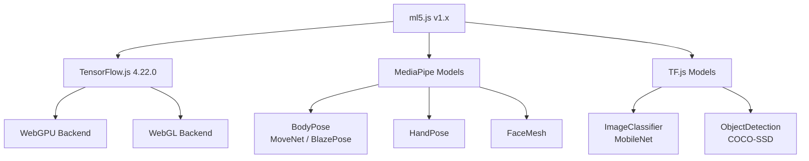
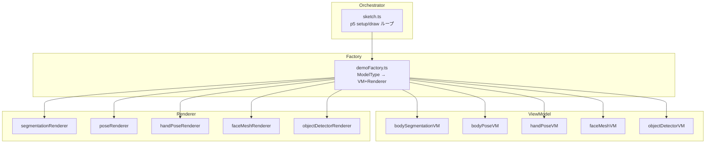
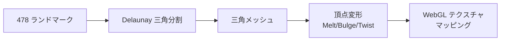

# ml5.js × p5.js でブラウザ ML デモを作ってみた

ブラウザだけでリアルタイムの機械学習デモって、どのくらい手軽に作れるんだろう？

そんな疑問から ml5.js を試してみたら、10 行程度のコードでカメラ映像からポーズ推定が動いて驚きました。さらに FaceMesh の 478 ランドマークを使って SnapChat 風のフェイスフィルターまで作れたので、そのプロセスを共有します。

## 作ったもの


5 つの ML モデルを切り替えて遊べるインタラクティブデモを作りました。

| 機能 | 説明 |
|------|------|
| **5 モデル切替** | BodySegmentation / BodyPose / HandPose / FaceMesh / ObjectDetector |
| **ソース切替** | フロントカメラ / プリセット動画 |
| **フェイスフィルター** | サングラス / 猫耳 / ヒーローマスク / ピエロ |
| **フェイスエフェクト** | 顔が溶ける / 膨らむ / ねじれる / メイク |

## ml5.js とは

ml5.js は「A neighborly approach to creating and exploring artificial intelligence in the browser」を掲げる、TensorFlow.js の上に構築されたフレンドリーな ML ライブラリです。

- **開発元**: NYU ITP/IMA（Google Education grant で資金提供）
- **対象ユーザー**: アーティスト、クリエイティブコーダー、学生
- **現在のバージョン**: v1.3.1



p5.js との相性が抜群で、クリエイティブコーディング × ML の鉄板の組み合わせです。

## 最小構成: 10 行で動くポーズ推定

まずは最小限のコードを見てみましょう。

```html
<script src="https://cdn.jsdelivr.net/npm/p5@1.9.0/lib/p5.min.js"></script>
<script src="https://unpkg.com/ml5@1/dist/ml5.js"></script>
```

```javascript
let model, video, results = [];

function preload() {
  model = ml5.bodyPose();
}

function setup() {
  createCanvas(640, 480);
  video = createCapture(VIDEO);
  video.hide();
  model.detectStart(video, (r) => results = r);
}

function draw() {
  image(video, 0, 0);
  for (let pose of results) {
    for (let kp of pose.keypoints) {
      if (kp.confidence > 0.5) circle(kp.x, kp.y, 10);
    }
  }
}
```

これだけで、カメラ映像の上に体のキーポイント（17 点）がリアルタイムで表示されます。

## 5 モデル対応の MVVM アーキテクチャ

1 モデルだけなら上記で十分ですが、複数モデルを切り替えられるデモを作るため、MVVM + Factory パターンで設計しました。



### 共通インターフェース

```typescript
// demoModule.ts
export interface DemoVM<T> {
  loadModel(onReady: () => void): void;
  startDetection(source: p5.Element): void;
  stopDetection(): void;
  getState(): T | null;
}

export interface DemoRenderer<T> {
  draw(p: p5, state: T | null, source: p5.Element): void;
}
```

### Factory パターン

```typescript
// demoFactory.ts
export type ModelType =
  | 'BodySegmentation'
  | 'BodyPose'
  | 'HandPose'
  | 'FaceMesh'
  | 'ObjectDetector';

export function createDemo(type: ModelType) {
  switch (type) {
    case 'BodyPose':
      return { vm: new BodyPoseVM(), renderer: new PoseRenderer() };
    case 'FaceMesh':
      return { vm: new FaceMeshVM(), renderer: new FaceMeshRenderer() };
    // ...
  }
}
```

この設計のおかげで、オーケストレーター（sketch.ts）はモデル固有のコードを一切持たずに済みました。新しいモデルを追加するときは「VM + Renderer を書いて Factory に登録」の 3 ステップで完了します。

## ハマりポイント 3 選

### 1. ml5.js は instance mode 非対応

p5.js には global mode と instance mode がありますが、ml5.js は **global mode 前提**で設計されています。

```javascript
// これはできない (instance mode)
const s = (p) => {
  p.preload = () => {
    const model = ml5.bodyPose(); // 内部で global の p5 を参照してしまう
  };
};
new p5(s);
```

回避策として、`p5.Image` を使わず生のピクセル配列（`result.data`）から直接描画しました。

### 2. モデル切替時の非同期ロード

ml5.js のモデル初期化は「コンストラクタは同期だがロードは非同期」という独特なパターンです。

```javascript
// NG: ロード完了前に detectStart を呼んでしまう
const model = ml5.faceMesh();
model.detectStart(video, callback); // モデルがまだ準備できていない

// OK: コールバックで待つ
const model = ml5.faceMesh({ flipped: true }, () => {
  model.detectStart(video, callback);
});
```

`preload()` 内では p5 が自動で待ってくれますが、ランタイムでモデルを切り替える場合は明示的なコールバックが必要です。

### 3. HTTPS 必須（LAN 内カメラアクセス）

スマホからデモを見せようと IP アドレスでアクセスしたら、カメラが動きませんでした。

```
getUserMedia is not implemented in this browser
```

`getUserMedia` は **Secure Context（HTTPS または localhost）** でしか動作しません。開発時は `@vitejs/plugin-basic-ssl` で自己証明書を発行して解決しました。

```javascript
// astro.config.mjs
import basicSsl from '@vitejs/plugin-basic-ssl';

export default defineConfig({
  server: { host: '0.0.0.0' },
  vite: { plugins: [basicSsl()] }
});
```

## フェイスフィルター実装

FaceMesh は **478 個**のランドマークを返します。これを使って SnapChat 風のフィルターを実装しました。

### 使用したランドマーク

```typescript
const LM = {
  noseTip: 1,
  foreheadTop: 10,
  chin: 152,
  leftEyeOuter: 33,
  leftEyeInner: 133,
  rightEyeOuter: 263,
  rightEyeInner: 362,
  leftEyebrowOuter: 46,
  rightEyebrowOuter: 276,
  upperLipTop: 13,
  lowerLipBottom: 14,
  leftMouthCorner: 61,
  rightMouthCorner: 291,
};
```

### サングラスフィルター

```typescript
function drawSunglasses(p: p5, kps: Keypoint[]) {
  const leftEye = kps[LM.leftEyeOuter];
  const rightEye = kps[LM.rightEyeOuter];
  const faceW = dist(leftEye.x, leftEye.y, rightEye.x, rightEye.y);
  const lensW = faceW * 0.5;
  const lensH = faceW * 0.25;

  // 左右のレンズ
  p.fill(30, 30, 30, 200);
  p.ellipse(leftEye.x, leftEye.y, lensW, lensH);
  p.ellipse(rightEye.x, rightEye.y, lensW, lensH);

  // ブリッジ（鼻の部分）
  p.stroke(50);
  p.strokeWeight(4);
  p.line(leftEye.x + lensW * 0.4, leftEye.y,
         rightEye.x - lensW * 0.4, rightEye.y);
}
```

ランドマーク間の距離（`faceW`）を基準にスケーリングすることで、顔の大きさや距離に追従します。

## メッシュ変形エフェクト（Delaunay + WebGL）

顔が溶けたり膨らんだりするエフェクトは、Delaunay 三角分割 + WebGL テクスチャマッピングで実現しました。



### Delaunay 三角分割

```typescript
import Delaunator from 'delaunator';

function buildMesh(keypoints: Keypoint[]) {
  const coords = keypoints.flatMap(kp => [kp.x, kp.y]);
  const delaunay = Delaunator.from(coords);
  return delaunay.triangles; // 頂点インデックスの配列
}
```

### 頂点変形（Melt エフェクト）

```typescript
function meltVertex(x: number, y: number, faceH: number, time: number) {
  const normalY = y / faceH;
  const wave = Math.sin(time * 2 + x * 0.02);
  const drip = normalY * normalY * wave * faceH * 0.4;
  return { x, y: y + drip };
}
```

### WebGL テクスチャ描画

```typescript
function drawMesh(pg: p5.Graphics, video: p5.Element, triangles: number[],
                  srcPts: Point[], dstPts: Point[]) {
  pg.textureMode(pg.IMAGE);
  pg.texture(video);

  for (let i = 0; i < triangles.length; i += 3) {
    pg.beginShape(pg.TRIANGLES);
    for (let j = 0; j < 3; j++) {
      const idx = triangles[i + j];
      pg.vertex(dstPts[idx].x, dstPts[idx].y,  // 変形後の位置
                srcPts[idx].x, srcPts[idx].y); // UV（元の位置）
    }
    pg.endShape();
  }
}
```

478 点の Delaunay 三角分割は顔の輪郭に沿った十分な密度があり、自然な変形ができます。Three.js なしでも `p5.createGraphics(w, h, WEBGL)` でテクスチャ三角形が描けるのは p5.js の隠れた強みです。

## パフォーマンス結果

| モデル | FPS | 備考 |
|--------|-----|------|
| FaceMesh | ~30fps | MacBook Pro M1 |
| BodyPose | ~28fps | MoveNet |
| HandPose | ~30fps | 1〜2 手 |
| BodySegmentation | ~25fps | SelfieSegmentation |
| ObjectDetector | ~30fps | COCO-SSD |

FaceMesh でメッシュエフェクトをオンにしても 25fps 以上を維持。実用的なパフォーマンスです。

## ブラウザ ML ライブラリの現在地

今回の調査で、ブラウザ ML の全体像も見えてきました。

```
@mediapipe/tasks-vision  ████████████████████████████████  ~2,159,000/week
onnxruntime-web          ██████                            ~320,000/week
@huggingface/transformers █████                            ~285,000/week
@tensorflow/tfjs         ████                              ~248,000/week
@mlc-ai/web-llm          ██                                ~103,000/week
ml5                      ▏                                 ~1,400-5,800/week
```

ml5.js は npm ダウンロード数では小さいですが、**教育・クリエイティブコーディング**という明確なニッチを持っています。

| ライブラリ | 向いている用途 |
|-----------|---------------|
| **ml5.js** | 学習、プロトタイプ、クリエイティブコーディング |
| **MediaPipe** | プロダクションのリアルタイムビジョン |
| **Transformers.js** | NLP、HuggingFace モデル（1,200+） |
| **WebLLM** | ブラウザ内 LLM 推論 |
| **ONNX Runtime Web** | 汎用推論エンジン（WebGPU/WebNN） |

ml5.js で「何ができるか」を素早く検証し、プロダクション化するなら MediaPipe や Transformers.js に移行するのが良さそうです。

## まとめ

### 達成できたこと

- 5 つの ML モデルをブラウザ上でリアルタイム動作
- SnapChat 風フェイスフィルター + メッシュ変形エフェクト
- カメラ / 動画切替対応
- LAN 内 HTTPS 対応でスマホからも動作

### 学んだこと

1. **ml5.js は 10 行で ML デモが動く** — プロトタイプには最適
2. **instance mode 非対応に注意** — 生ピクセル配列で回避可能
3. **非同期ロードの罠** — ランタイム切替には `onReady` コールバック必須
4. **FaceMesh + Delaunay = 強力** — 478 点で高品質なメッシュ変形
5. **p5.js の WebGL は意外と使える** — Three.js なしでテクスチャマッピング可能

### 次に試したいこと

- [ ] WebLLM でブラウザ内 LLM チャット
- [ ] Transformers.js で HuggingFace モデル検証
- [ ] ONNX Runtime Web の WebGPU パフォーマンス

ブラウザ ML の世界、思った以上に楽しいです。

---

**元の R&D メモ**: `rnd_memo/notes/004_ml5js_browser_ml/index.md`
