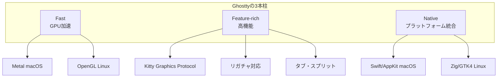

# Ghostty ターミナルエミュレータ調査

## 仮説

Ghosttyが流行している理由は、「速度」「機能」「ネイティブUI」の3つを同時に実現しているからではないか。

## 評価基準

| 指標 | 目標値 | 現在値 |
|------|--------|--------|
| 理解度 | 高 | 達成 |
| 採用判断 | 可能 | 達成 |

**成功条件**: Ghosttyの強み・弱みを理解し、自分に合うか判断できる

**失敗条件**: 情報が不足して判断できない

## リサーチ

### 参考資料

- [Ghostty公式ドキュメント](https://ghostty.org/docs/about) - 公式の設計思想
- [GitHub - ghostty-org/ghostty](https://github.com/ghostty-org/ghostty) - ソースコード
- [Ghostty Terminal: Never Understood the Hype Until I tried it](https://itsfoss.com/ghostty-terminal-features/) - レビュー記事
- [Choosing a Terminal on macOS (2025)](https://medium.com/@dynamicy/choosing-a-terminal-on-macos-2025-iterm2-vs-ghostty-vs-wezterm-vs-kitty-vs-alacritty-d6a5e42fd8b3) - 比較記事
- [The Modern Terminals Showdown](https://blog.codeminer42.com/modern-terminals-alacritty-kitty-and-ghostty/) - 技術比較

### 発見

#### Ghosttyとは

**開発者**: Mitchell Hashimoto（Vagrant, Terraform, HashiCorpの創設者）

**コンセプト**: 「Fast, Feature-rich, Native」の3つを同時に実現

従来のターミナルエミュレータは以下の3つから最大2つしか選べなかった：
- 速度（Performance）
- 機能（Features）
- ネイティブUI（Native）

Ghosttyはこの3つすべてを提供することを目指している。

#### 主要な特徴

**1. GPUアクセラレーション**
- macOS: Metal（iTerm以外で唯一Metal対応かつリガチャ対応）
- Linux: OpenGL
- スクロールが滑らか、大きなログファイルでもラグなし

**2. ネイティブUI**
- macOS: Swift + AppKit + SwiftUI
- Linux: Zig + GTK4
- タブ、スプリット、エラーメッセージなどがOS標準のUIコンポーネント
- プラットフォーム固有のキーバインドをデフォルトで尊重

**3. 高度なターミナル機能**
- Kitty Graphics Protocol（画像表示）
- ライト/ダークモード通知
- ハイパーリンク対応
- Nerd Fonts デフォルトサポート

**4. アーキテクチャ**
- コア: `libghostty`（C-ABI互換ライブラリ）
- クロスプラットフォームのコアを共有しつつ、UIはネイティブ実装

#### 競合との比較

| 特徴 | Ghostty | iTerm2 | Alacritty | Kitty |
|------|---------|--------|-----------|-------|
| GPU加速 | Metal | - | OpenGL | OpenGL |
| ネイティブUI | macOS/Linux | macOS only | - | - |
| リガチャ | Yes | Yes | No | Yes |
| 画像プロトコル | Kitty | iTerm | - | Kitty |
| メモリ使用量 | 中 | 重 | 軽(~30MB) | 中 |
| 設定の容易さ | 良 | GUI有 | 要設定 | 要設定 |
| tmux統合 | - | ネイティブ統合 | - | - |

#### 使い分けの推奨

| ユースケース | 推奨ターミナル |
|-------------|----------------|
| 速くてMacらしい体験 | **Ghostty** |
| tmux + macOSネイティブ | iTerm2 |
| 最軽量を求める | Alacritty |
| 最も機能豊富 | Kitty |

#### 価格

**完全無料**。サブスクリプションなし、オープンソース。

#### 制限事項

- iTerm2ほどの高度な機能や統合はない
- GUI設定パネルがない（設定ファイル編集が必要）
- 比較的新しいプロジェクト（2024年末v1.0、2026年現在v2.0）

## 実験ログ

### 2026-02-05 10:00 - 初期調査

#### 課題/チャレンジ

Ghosttyが何故流行っているのか、何が良いのかを理解する。

#### アクション

- Web検索でGhosttyに関する情報を収集
- 公式ドキュメントを確認
- 競合製品との比較記事を調査

#### 生データ（事実のみ、解釈なし）

**バージョン情報**:
- 2024年末: v1.0リリース
- 2026年現在: v2.0

**開発者**: Mitchell Hashimoto（HashiCorp創設者）

**技術スタック**:
- コア: Zig言語
- macOS UI: Swift/AppKit/SwiftUI
- Linux UI: GTK4
- レンダリング: Metal(macOS) / OpenGL(Linux)

**ベンチマーク**:
- 60 FPS維持（重負荷時）

#### 分析（解釈、判断）

**Ghosttyが流行っている理由**:

1. **開発者の信頼性**: HashiCorp製品（Vagrant, Terraform）の実績がある開発者
2. **「いいとこ取り」の設計**: Alacrittyの速度 + Kittyの機能 + ネイティブUI
3. **デフォルトの良さ**: Nerd Fontsデフォルト対応など、設定なしですぐ使える
4. **無料**: オープンソース、課金なし

**こんな人におすすめ**:
- 現在iTerm2を使っていて、もっと軽快なターミナルが欲しい人
- Alacrittyの速度は好きだが、リガチャや画像表示が欲しい人
- 新しいターミナルを試したいが、設定に時間をかけたくない人

**おすすめしない人**:
- tmuxとの深い統合が必要な人（iTerm2が優位）
- GUI設定パネルが必須な人
- 極限までメモリを節約したい人（Alacrittyが優位）

---

## 結論

### 最終結果

Ghosttyが流行っている理由を特定。「Fast + Feature-rich + Native」の3つを同時に提供する点が最大の差別化要因。

### 学び

- ターミナルエミュレータは従来「速度」「機能」「ネイティブUI」のうち2つしか選べなかった
- Ghosttyはこの制約を打破しようとしている
- 開発者（Mitchell Hashimoto）の実績と信頼性も人気の要因
- デフォルト設定の良さにより、設定なしですぐ使える

### 次のステップ

- 実際にインストールして試す（必要であれば）
- 現在使用中のターミナルとの比較（必要であれば）
