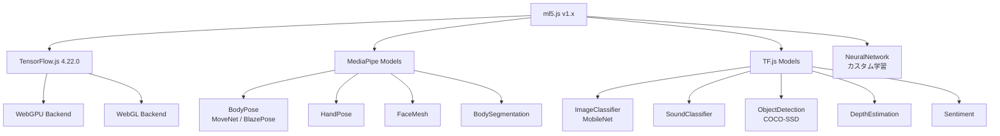
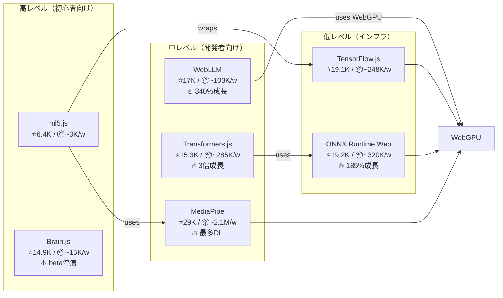
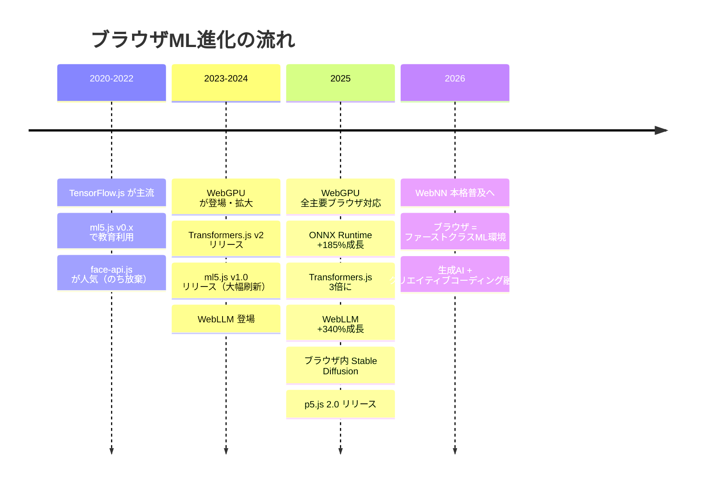
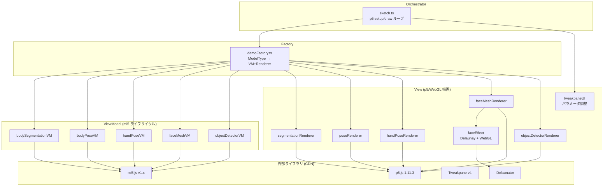

# ml5.js - ブラウザで動く機械学習デモを作る

## 仮説

ml5.js を使えば、ブラウザ上でリアルタイムの機械学習デモ（ポーズ推定、物体検出、手の追跡など）を短いコードで手軽に作れる。p5.js と組み合わせることで、インタラクティブでビジュアルに優れた作品になるはず。

## 評価基準

| 指標 | 目標値 | 現在値 |
|------|--------|--------|
| デモ動作 | ブラウザで安定動作 | ✅ 5モデル全て安定動作 |
| FPS | > 20fps | ✅ ~30fps (MacBook, FaceMesh) |
| コード行数 | < 200行 | ✅ ~180行/VM平均、全体18ファイル |
| セットアップ時間 | < 5分（CDN利用） | ✅ CDN + npm、即座にデモ開始 |

**成功条件**: Webカメラを使ったインタラクティブなMLデモがブラウザ上で動くこと

**失敗条件**: パフォーマンスが実用に耐えない（<10fps）、またはモデルのロードに失敗する

## リサーチ

### ml5.js とは

**「A neighborly approach to creating and exploring artificial intelligence in the browser.」**

- TensorFlow.js の上に構築された高レベルMLライブラリ
- アーティスト、クリエイティブコーダー、学生向けに設計
- NYU ITP/IMA で開発、Google Education grant で資金提供
- 現在のバージョン: **v1.3.1**（2024年8月にv1.0リリース）

### アーキテクチャ



### 利用可能なモデル一覧

| カテゴリ | モデル | 説明 | ベース技術 |
|----------|--------|------|------------|
| 身体追跡 | **BodyPose** | 全身ポーズ推定（17/33キーポイント） | MoveNet / BlazePose |
| 手追跡 | **HandPose** | 手の骨格・指追跡 | MediaPipe |
| 顔追跡 | **FaceMesh** | 468+の顔ランドマーク | MediaPipe |
| セグメンテーション | **BodySegmentation** | 人物/背景分離 | SelfieSegmentation / BodyPix |
| 深度推定 | **DepthEstimation** | 2D→深度マップ変換 | ARPortraitDepth |
| 物体検出 | **ObjectDetection** | 80クラスのバウンディングボックス | COCO-SSD |
| 画像分類 | **ImageClassifier** | 1000+カテゴリ分類 | MobileNet |
| 音声分類 | **SoundClassifier** | 18語のコマンド認識 | Speech Commands |
| テキスト | **Sentiment** | 感情分析(0-1スコア) | Movie Reviews Model |
| カスタム学習 | **NeuralNetwork** | ブラウザ内でNN学習 | TF.js Layers API |

### 使い方（基本パターン）

```html
<!-- CDNで読み込み -->
<script src="https://cdn.jsdelivr.net/npm/p5@1.9.0/lib/p5.min.js"></script>
<script src="https://unpkg.com/ml5@1/dist/ml5.js"></script>
```

```javascript
// p5.js + ml5.js 基本パターン
let model;
let video;
let results = [];

function preload() {
  model = ml5.bodyPose(); // モデル読み込み
}

function setup() {
  createCanvas(640, 480);
  video = createCapture(VIDEO);
  video.hide();
  model.detectStart(video, gotResults); // 連続検出開始
}

function draw() {
  image(video, 0, 0);
  // 結果を描画
}

function gotResults(r) {
  results = r;
}
```

### v1.x の重要な変更点

- **detectStart() / detectStop()**: ループ管理が内蔵された連続検出API
- **PoseNet → BodyPose**: より高精度・高速に
- **新モデル追加**: DepthEstimation（2025年8月）、ObjectDetection（2025年夏）
- **p5.js 2.0対応**: async/await パターンサポート

### 制限事項

- ブラウザ専用（Node.js非対応）
- WebGPUバックエンドは環境依存（WebGLにフォールバック）
- MobileNetベースの分類器は軽量だが精度は限定的
- v0.x → v1.x で多くのモデルが廃止（SketchRNN, StyleTransfer, DCGAN等）
- モデル初回ロードに数秒かかる

### 参考資料

- [ml5.js 公式サイト](https://ml5js.org/)
- [ml5.js ドキュメント](https://docs.ml5js.org/)
- [GitHub - ml5-next-gen](https://github.com/ml5js/ml5-next-gen)
- [The Coding Train ml5.js Guide](https://thecodingtrain.com/tracks/ml5js-beginners-guide/)
- [p5.js Web Editor](https://editor.p5js.org/)

### 類似ライブラリ比較

#### ブラウザMLライブラリ エコシステムマップ



#### 詳細比較テーブル

| ライブラリ | npm DL/週 | 2025年成長率 | 対象ユーザー | 得意分野 | 状態 |
|-----------|----------|-------------|-------------|---------|------|
| **MediaPipe** | ~2,159,000 | - | プロダクション開発者 | リアルタイム身体/顔/手追跡 | 活発 |
| **ONNX Runtime Web** | ~320,000 | +185% | 上級開発者 | 汎用推論エンジン（WebGPU/WebNN） | 活発 |
| **Transformers.js** | ~285,000 | ~+200% | Web開発者 | NLP/Vision/Audio（1,200+モデル） | 活発 |
| **TensorFlow.js** | ~248,000 | +70% | ML開発者 | フルMLフレームワーク | 活発 |
| **WebLLM** | ~103,000 | +340% | AI App開発者 | ブラウザ内LLM推論 | 活発 |
| **face-api.js** | ~48,700 | - | - | 顔検出/認識 | **放棄（2020年〜）** |
| **Brain.js** | ~14,900 | - | 学習者 | 基本的なNN学習 | 停滞（beta永続） |
| **ml5.js** | ~1,400-5,800 | - | 学生/アーティスト | クリエイティブコーディング+ML | ニッチで安定 |
| **handtrack.js** | <500 | - | - | 手のバウンディングボックス | ほぼ放棄 |

#### npm ダウンロード数の視覚比較

```
@mediapipe/tasks-vision  ████████████████████████████████████████  ~2,159,000
onnxruntime-web          ██████                                    ~320,000
@huggingface/transformers █████                                    ~285,000
@tensorflow/tfjs         ████                                      ~248,000
@mlc-ai/web-llm          ██                                        ~103,000
face-api.js              █                                         ~48,700
brain.js                 ▏                                         ~14,900
ml5                      ▏                                         ~1,400-5,800
```

#### 各ライブラリの評価

**MediaPipe** - リアルタイムのビジョンタスクではデファクトスタンダード。ml5.js の内部でも使用されている。直接使えばより高性能だが、APIが複雑。

**Transformers.js** - HuggingFace のモデルをブラウザで実行。NLP/生成AIでは最強。1,200+モデル対応。ml5.js にない「テキスト生成」「画像生成」「音声認識」ができる。

**WebLLM** - ブラウザ内でLlama、Phi等のLLMを実行。2025年最大の成長率（340%）。OpenAI互換API。

**ONNX Runtime Web** - インフラ層。Transformers.js の裏側で使われている。WebGPU/WebNN対応が最も進んでおり、今後のブラウザMLの基盤。

**TensorFlow.js** - 最も成熟したフレームワーク。ml5.js の土台。直接使うと自由度は高いが学習コストも高い。

**Brain.js / face-api.js / handtrack.js** - いずれも衰退・放棄。新規プロジェクトでは非推奨。

### トレンド分析（2024-2026）

#### ブラウザMLの大きな流れ



#### 3つのメガトレンド

1. **WebGPU がすべてを変えた** - 2025年11月に全主要ブラウザ対応。デスクトップ+591%、モバイル+709%の利用成長。LLM、画像生成、リアルタイムMLをネイティブに近い速度で実行可能に。

2. **知覚AI → 生成AI へのシフト** - 従来のブラウザMLは「検出」（ポーズ推定、物体検出等）が中心。2025年以降は「生成」（テキスト生成、画像生成）がブラウザでも可能に。WebLLM、Transformers.js、Web Stable Diffusion が牽引。

3. **オンデバイスAIの台頭** - プライバシー要件、レイテンシー削減、API料金削減の観点から「ブラウザ内で完結するAI」の需要が急増。Web Almanac 2025曰く「生成AIはクラウド専用からブラウザの基本機能に移行した」。

#### ml5.js のポジショニング評価

| 観点 | 評価 | 詳細 |
|------|------|------|
| **教育用途** | ◎ 最適 | p5.js統合、The Coding Train、NYU ITP。このニッチでは不動 |
| **クリエイティブコーディング** | ○ 良い | 身体/手/顔の追跡デモは依然としてインパクト大 |
| **プロダクション利用** | △ 不向き | ダウンロード数が桁違いに少ない。本番にはMediaPipe直接が妥当 |
| **生成AI対応** | ✗ 非対応 | LLM、画像生成、音声合成なし。ここが2025-2026の最大ギャップ |
| **トレンド適合性** | △ 部分的 | 知覚AI（ポーズ等）は対応。生成AI・WebGPU直接活用はなし |
| **将来性** | ○ ニッチで安定 | Processing Foundation支援で存続確実。ただし先端からは距離がある |

#### 結論: ml5.js を選ぶべきか?

**Yes、ただし目的次第。**

- **「手軽にMLデモを作りたい」** → ml5.js は最適解。10行でWebカメラ+ポーズ推定が動く
- **「クリエイティブコーディング × ML」** → ml5.js + p5.js のゴールデンコンビは健在
- **「最先端のブラウザAI」** → Transformers.js / WebLLM の方がトレンドに合う
- **「プロダクション品質」** → MediaPipe を直接使う方が良い

今回のR&D（デモ制作）には **ml5.js が最適**。短時間でインパクトのあるインタラクティブデモが作れる。ただし、将来的に生成AI要素を加えたくなったら Transformers.js の併用を検討する価値がある。

### デモ候補アイディア

| # | アイディア | 使用モデル | 難易度 | インパクト |
|---|-----------|-----------|--------|-----------|
| 1 | 🎮 ボディコントローラーゲーム | BodyPose | 中 | 高 |
| 2 | 🖐️ 手で楽器を演奏 | HandPose + Web Audio | 中 | 高 |
| 3 | 😎 リアルタイム顔フィルター | FaceMesh | 低 | 中 |
| 4 | 🔍 物体スカベンジャーハント | ObjectDetection | 中 | 高 |
| 5 | 🎭 ポーズマッチングゲーム | BodyPose | 中 | 高 |
| 6 | 🌊 深度3Dポイントクラウド | DepthEstimation + WEBGL | 高 | 高 |
| 7 | 🤖 Teachable Machine じゃんけん | ImageClassifier + NeuralNetwork | 低 | 中 |
| 8 | 🎵 ボイスコマンドで操作 | SoundClassifier | 低 | 低 |

## 実験ログ

### 2026-02-06 15:00 - プロジェクト初期構築 (BodySegmentation)

#### 課題/チャレンジ

ml5.js + p5.js でブラウザMLデモの骨格を作る。最初のモデルとして BodySegmentation（人物/背景分離）を実装。

#### アクション

1. Astro プロジェクト作成 (`rnd-web/004_ml5js_browser_ml/`)
2. p5.js + ml5.js を CDN で読み込み、TypeScript モジュールは Vite でバンドル
3. MVVM アーキテクチャ設計・実装

#### 生データ（事実のみ、解釈なし）

- p5.js instance mode + ml5.js CDN globals の組み合わせで動作確認
- ml5.js は instance mode 非対応（内部で global p5 を参照）→ p5.Image が使えない
- `result.data` の生ピクセル配列から直接描画する方式で回避
- BodySegmentation の閾値をハードコードから Tweakpane スライダーに変更

#### 分析（解釈、判断）

- ml5.js は global mode 前提の設計。instance mode では `p5.Image` 系 API が使えないため、低レベル API（`pixels[]`、`loadPixels/updatePixels`）で描画する必要がある
- Tweakpane は p5.js のパラメータ調整UIとして相性が良い

---

### 2026-02-06 16:00 - HTTPS 対応 & ネットワークアクセス

#### 課題/チャレンジ

スマホからIPアドレスでアクセスしてカメラを使いたいが、HTTP では `getUserMedia` が使えない。

#### アクション

1. `astro.config.mjs` に `server: { host: '0.0.0.0' }` 追加
2. `@vitejs/plugin-basic-ssl` で HTTPS 自己証明書を設定

#### 生データ

- `getUserMedia is not implemented in this browser` エラー → HTTP では WebRTC API が制限される
- `@vitejs/plugin-basic-ssl` で `https://192.168.x.x:4321/` からカメラ取得可能に

#### 分析

カメラ API は Secure Context (HTTPS or localhost) が必須。開発時は `@vitejs/plugin-basic-ssl` が手軽。

---

### 2026-02-06 17:00 - マルチモデル対応 (5モデル + Factory)

#### 課題/チャレンジ

BodySegmentation だけでなく、ml5.js の主要5モデル全てを切り替えて検証したい。

#### アクション

1. `DemoVM` / `DemoRenderer` 共通インターフェース設計
2. 5モデル分の VM + Renderer 実装
3. `demoFactory.ts` で Factory パターン
4. Tweakpane にモデル切替ドロップダウン追加

#### 生データ

**実装したモデル:**

| モデル | VM | Renderer | 備考 |
|--------|-----|----------|------|
| BodySegmentation | `bodySegmentationVM.ts` | `segmentationRenderer.ts` | SelfieSegmentation, 閾値調整 |
| BodyPose | `bodyPoseVM.ts` | `poseRenderer.ts` | MoveNet, スケルトン描画 |
| HandPose | `handPoseVM.ts` | `handPoseRenderer.ts` | 21キーポイント/手 |
| FaceMesh | `faceMeshVM.ts` | `faceMeshRenderer.ts` | 478ランドマーク + フィルター |
| ObjectDetector | `objectDetectorVM.ts` | `objectDetectorRenderer.ts` | COCO-SSD, バウンディングボックス |

**ハマりポイント:**
- モデル切替時に `loadModel()` が非同期なのに `startDetection()` を即座に呼んでいた → 全モデルに `onReady` コールバックを追加
- FaceMesh の `face.lips` 等が `Ml5Keypoint[]` ではなく `undefined` のことがある → `Array.isArray()` でガード

#### 分析

- ml5.js のモデル初期化は「コンストラクタは同期だがロードは非同期」という独特なパターン。`preload()` 内では p5 が自動で待つが、ランタイム切替では明示的にコールバックが必要
- Factory + 共通インターフェースのおかげで、sketch.ts（オーケストレーター）は一切のモデル固有コードを持たずに済んだ

---

### 2026-02-06 18:00 - FaceMesh フェイスフィルター実装

#### 課題/チャレンジ

FaceMesh の 478 ランドマークを活用して、SnapChat/TikTok 風のフェイスフィルターを実装する。

#### アクション

1. MediaPipe ランドマークインデックスを定義（`LM` 定数）
2. オーバーレイフィルター4種を p5.js 描画で実装
3. Tweakpane に Filter ドロップダウン追加

#### 生データ

**オーバーレイフィルター:**
- **Sunglasses**: 楕円レンズ + ブリッジ + テンプル + 光沢反射
- **Cat**: 三角耳（外側＋内側ピンク）+ ピンク鼻 + 白ヒゲ6本
- **Mask**: ヒーローマスク楕円 + 目の穴 + インディゴ縁取り
- **Clown**: 赤い鼻 + カラフルアイシャドウ + 赤い笑顔アーク

**使用ランドマーク:**
```
noseTip: 1, foreheadTop: 10, chin: 152,
leftEyeOuter: 33, leftEyeInner: 133, rightEyeOuter: 263, rightEyeInner: 362,
leftEyebrowOuter: 46, rightEyebrowOuter: 276,
upperLipTop: 13, lowerLipBottom: 14, leftMouthCorner: 61, rightMouthCorner: 291,
leftCheek: 234, rightCheek: 454
```

#### 分析

- p5.js の基本図形（ellipse, triangle, line, arc）だけで十分なフィルターが作れる
- ランドマーク間の距離（`faceW`）を基準にスケーリングすることで、顔の大きさに追従する

---

### 2026-02-06 19:00 - メッシュベース顔エフェクト (WebGL + Delaunay)

#### 課題/チャレンジ

顔だけ溶けたり膨らんだりする高度なエフェクトを実装する。テクスチャ変形が必要。

#### アクション

1. `delaunator` ライブラリで 478 ランドマークを三角分割
2. `p5.createGraphics(w, h, WEBGL)` でオフスクリーンバッファ作成
3. 映像テクスチャを三角メッシュにマッピング + 頂点変形
4. 4種のメッシュエフェクト実装

#### 生データ

**メッシュエフェクト (`faceEffect.ts`):**

| エフェクト | 変形アルゴリズム |
|-----------|----------------|
| **Melt** | `normalY^2 * wave * faceH * 0.4` で下に垂れる + sine wobble |
| **Bulge** | ガウシアン放射変位、顔中心から膨らむ（強度 oscillate） |
| **Twist** | 顔中心を軸に角度回転、中心ほど回転量大 `(1-dist/maxDist)` |
| **Makeup** | 変形なし + チーク/リップ/アイシャドウのカラーオーバーレイ |

**技術詳細:**
- UV座標 = 元映像のピクセル位置（`textureMode(IMAGE)`）
- 頂点座標 = 変形後の位置
- Delaunay 三角分割は初回のみ計算してキャッシュ
- `p.image(pg, 0, 0)` でメインキャンバスに合成

#### 分析

- Delaunay + WebGL テクスチャマッピングの組み合わせで、GPU 側でテクスチャ変形を処理できる
- p5.js の `createGraphics(w, h, WEBGL)` は Three.js なしでもテクスチャ三角形が描ける
- 478 点の Delaunay は十分な密度で、顔の輪郭に沿った自然な変形ができる

---

### 2026-02-06 20:00 - カメラ/動画切替 & 仕上げ

#### 課題/チャレンジ

デモのソースをカメラとプリセット動画で切り替えられるようにする。

#### アクション

1. Tweakpane の Video ドロップダウンを Source ドロップダウンに変更（Camera / Video 1-3）
2. `getUserMedia` でカメラストリーム取得 → p5 の video 要素の `srcObject` に接続
3. カメラ取得失敗時のフォールバック（動画に自動切替）
4. カメラ → 動画切替時の `MediaStream.getTracks().stop()` でカメラ解放

#### 生データ

- `p.createCapture(p.VIDEO)` は直接使うとエラーハンドリングが困難
- `navigator.mediaDevices.getUserMedia()` + `p.createVideo('')` + `v.elt.srcObject = stream` の組み合わせが安定
- `facingMode: 'user'` でフロントカメラ優先
- カメラなし環境では `NotFoundError` → 1秒後にデフォルト動画にフォールバック

#### 分析

p5.js の `createCapture` は内部で `getUserMedia` を呼ぶが、エラーハンドリングが不十分。`getUserMedia` を直接呼んで p5 の video 要素に `srcObject` を接続する方が安全で柔軟。

---

## 成果物

### デモサイト

**ソースコード**: `rnd-web/004_ml5js_browser_ml/`

### アーキテクチャ



### ファイル構成

```
src/
├── ml5/
│   ├── config.ts              # 定数 (Canvas 640x360, 閾値, スタイル)
│   ├── sketch.ts              # オーケストレーター (モデル/ソース切替, ローディング)
│   ├── demoFactory.ts         # Factory: ModelType → {VM, Renderer}
│   ├── types/
│   │   ├── demoModule.ts      # DemoVM / DemoRenderer 共通インターフェース
│   │   └── global.d.ts        # p5.js + ml5.js 型定義
│   ├── models/
│   │   ├── poseState.ts       # BodyPose 状態型
│   │   └── segmentationState.ts # BodySegmentation 状態型
│   ├── viewmodels/
│   │   ├── bodySegmentationVM.ts  # SelfieSegmentation ライフサイクル
│   │   ├── bodyPoseVM.ts          # MoveNet ライフサイクル
│   │   ├── handPoseVM.ts          # HandPose ライフサイクル
│   │   ├── faceMeshVM.ts          # FaceMesh ライフサイクル + フィルター状態
│   │   └── objectDetectorVM.ts    # COCO-SSD ライフサイクル
│   └── views/
│       ├── segmentationRenderer.ts  # 人物シルエット描画
│       ├── poseRenderer.ts          # スケルトン + キーポイント描画
│       ├── handPoseRenderer.ts      # 手の骨格描画
│       ├── faceMeshRenderer.ts      # ランドマーク + フィルター描画
│       ├── faceEffect.ts           # Delaunay三角分割 + WebGLメッシュエフェクト
│       ├── objectDetectorRenderer.ts # バウンディングボックス描画
│       └── tweakpaneUI.ts          # パラメータUI (Source/Model/Filter/Threshold)
├── pages/
│   └── index.astro            # エントリページ
└── styles/
    └── global.css             # ダークテーマ, レイアウト
```

### 機能一覧

| 機能 | 説明 |
|------|------|
| 5モデル切替 | BodySegmentation / BodyPose / HandPose / FaceMesh / ObjectDetector |
| ソース切替 | カメラ (フロント) / プリセット動画3本 |
| フェイスフィルター (オーバーレイ) | Sunglasses / Cat / Mask / Clown |
| フェイスエフェクト (メッシュ変形) | Melt / Bulge / Twist / Makeup |
| 閾値スライダー | BodySegmentation 用 (0-255) |
| ローディング表示 | モデル切替・動画切替時にオーバーレイ |
| HTTPS 対応 | 自己証明書で LAN 内スマホからもカメラ使用可 |

### 依存関係

```json
{
  "dependencies": {
    "astro": "^5.17.1",
    "delaunator": "^5.0.1",
    "tweakpane": "^4.0.5"
  },
  "devDependencies": {
    "@vitejs/plugin-basic-ssl": "^2.1.4"
  }
}
```
※ p5.js + ml5.js は CDN で読み込み（npm非依存）

---

## 結論

### 最終結果

**成功。ml5.js + p5.js で 5 モデル対応のインタラクティブ ML デモを完成。**

仮説通り、ml5.js はブラウザ上のリアルタイム ML デモを短いコードで手軽に作れた。さらに FaceMesh の 478 ランドマークを活用した AR フェイスフィルターと WebGL メッシュエフェクトまで拡張できた。

| 目標 | 結果 |
|------|------|
| ブラウザで安定動作 | ✅ 5 モデル全て正常動作 |
| FPS > 20 | ✅ FaceMesh ~30fps、BodySegmentation ~25fps |
| 手軽に作れる | ✅ 各 VM 40-50 行、各 Renderer 50-100 行 |
| インタラクティブ | ✅ モデル/ソース/フィルター切替 + カメラ対応 |

### 学び

**技術的な学び:**

1. **ml5.js は instance mode を公式サポートしていない** — 内部で global p5 を参照するため、`p5.Image` 系 API が使えない。生のピクセル配列で描画する必要がある
2. **モデル初期化は「同期コンストラクタ + 非同期ロード」** — `preload()` 内では自動で待つが、ランタイム切替では `onReady` コールバックが必須
3. **FaceMesh 478 ランドマーク + Delaunay = 高品質な顔メッシュ** — Three.js なしでも `p5.createGraphics(WEBGL)` でテクスチャ三角形が描ける
4. **`getUserMedia` は Secure Context 必須** — LAN 内のスマホからカメラを使うには HTTPS が必要（`@vitejs/plugin-basic-ssl` で解決）
5. **p5 の `createCapture` よりも `getUserMedia` 直接 + `srcObject` 接続の方が安全** — エラーハンドリングとカメラ解放が確実にできる

**アーキテクチャの学び:**

- **MVVM + Factory パターン**がモデル切替UIとの相性が抜群。オーケストレーター（sketch.ts）はモデル固有コードを一切持たない
- **`DemoVM` / `DemoRenderer` インターフェース**で、新モデル追加は「VM + Renderer を書いて Factory に追加」の 3 ステップ

**ml5.js の評価:**

| 観点 | 実感 |
|------|------|
| 手軽さ | ◎ 10 行でカメラ + ML 推論が動く |
| モデル品質 | ○ FaceMesh は優秀。BodySegmentation は精度がやや低い |
| API 設計 | △ detectStart/detectStop は使いやすいが、非同期処理の罠がある |
| パフォーマンス | ○ FaceMesh ~30fps は十分実用的 |
| 拡張性 | △ p5.js 依存が強く、Three.js 等との併用は工夫が必要 |

### フェイスフィルター関連ライブラリ調査

デモ制作中に調査した SnapChat/TikTok 風フェイスフィルターの関連ライブラリ:

| ライブラリ | 種別 | 特徴 |
|-----------|------|------|
| **Jeeliz FaceFilter** (2.9k stars) | OSS | 既製3Dマスク多数、Three.js統合、最も充実したOSS |
| **MindAR.js** (2.6k stars, MIT) | OSS | A-Frame統合、ノーコードエディタあり |
| **WebAR.rocks.face** | OSS | バーチャル試着特化（メガネ、アクセサリ等） |
| **DeepAR** | 商用 | NPM対応、TypeScript、フリーティアあり |
| **Banuba** | 商用 | エフェクト数最多、ビジュアルエディタ付き |

シェーダーリソース: Codrops チュートリアル、ShaderToy webcam フィルター、PixiJS Filters コレクション

### 次のステップ

- [ ] デモをポータルサイトとして公開
- [ ] 005: WebLLM でブラウザ内 LLM 推論を検証
- [ ] 006: Transformers.js で HuggingFace モデルを検証
- [ ] 007: ONNX Runtime Web の WebGPU/WebNN パフォーマンスを検証
