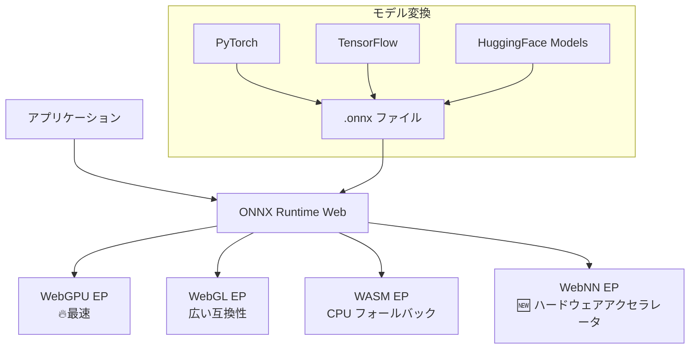

# ONNX Runtime Web - ブラウザMLの基盤エンジン

## 仮説

ONNX Runtime Web は WebGPU/WebNN 対応の汎用ML推論エンジンとして、任意のONNXモデルをブラウザで高速実行できる。Transformers.js の裏側でも使われている「インフラ層」の実力を直接検証したい。

## 評価基準

| 指標 | 目標値 | 現在値 |
|------|--------|--------|
| WebGPU推論速度 | WebGLの2倍以上 | - |
| モデル互換性 | ONNX形式なら何でも動く | - |
| セットアップ難度 | 中級者なら30分以内 | - |
| Stable Diffusion動作 | ブラウザで画像生成 | - |

**成功条件**: WebGPU バックエンドでONNXモデルを高速実行し、WebGL比で明確な性能差を確認すること

**失敗条件**: モデル変換が複雑すぎる、またはWebGPU非対応環境でフォールバックが機能しない

## リサーチ

### ONNX Runtime Web とは

- **Microsoft が開発するクロスプラットフォームML推論ランタイムのWeb版**
- 任意のONNX形式モデルをブラウザで実行
- GitHub: ⭐19,200 / npm: ~320,000 DL/週
- **2025年成長率: +185%**（773K→2.2M月間DL、エコシステム全体）
- 最新バージョン: 1.23.2

### 主な特徴

| 特徴 | 詳細 |
|------|------|
| **バックエンド** | WebGPU（最速）、WebGL、WebAssembly、WebNN |
| **モデル形式** | ONNX（PyTorch/TensorFlow/etc. から変換可能） |
| **WebGPU性能** | Segment Anything エンコーダで19倍高速化 |
| **FP16対応** | 半精度浮動小数点でメモリ・速度最適化 |
| **生成AI** | Stable Diffusion Turbo がブラウザで動作 |
| **開発元** | Microsoft（Intel と共同でWebNN推進） |

### アーキテクチャ



### セットアップ

```bash
npm install onnxruntime-web
```

```javascript
import * as ort from 'onnxruntime-web';

// WebGPU バックエンドを指定
ort.env.wasm.numThreads = 4;

const session = await ort.InferenceSession.create('./model.onnx', {
  executionProviders: ['webgpu', 'wasm'], // フォールバック順
});

const feeds = { input: new ort.Tensor('float32', inputData, [1, 3, 224, 224]) };
const results = await session.run(feeds);
console.log(results.output.data);
```

### WebGPU vs WebGL 性能比較

| モデル | WebGL | WebGPU | 高速化 |
|--------|-------|--------|--------|
| Segment Anything (encoder) | 基準 | **19倍** | WebGPU圧勝 |
| Stable Diffusion Turbo | 動作不可 | **<1秒/画像** (RTX 4090) | WebGPU専用 |
| 一般的な分類モデル | 基準 | **2-5倍** | 大幅改善 |

### WebNN について

- **W3C Web Neural Network API** - ブラウザからハードウェアアクセラレータに直接アクセス
- Chromium系で実装進行中、Firefox が2025年11月に参加
- GPU、NPU（Neural Processing Unit）、CPU の最適バックエンドを自動選択
- 2026-2027年に本格普及の見込み
- ONNX Runtime Web が最初のWebNN対応推論エンジン

### ユースケース候補

- WebGPU でのモデル推論ベンチマーク比較
- PyTorch → ONNX 変換 → ブラウザ実行のパイプライン構築
- Stable Diffusion in Browser の検証
- カスタムモデルのブラウザデプロイ
- WebNN の実装状況と性能検証

### 参考資料

- [ONNX Runtime Web ドキュメント](https://onnxruntime.ai/docs/tutorials/web/)
- [ONNX Runtime GitHub](https://github.com/microsoft/onnxruntime)
- [Microsoft Blog: WebGPU で生成AI](https://opensource.microsoft.com/blog/2024/02/29/onnx-runtime-web-unleashes-generative-ai-in-the-browser-using-webgpu)
- [npm: onnxruntime-web](https://www.npmjs.com/package/onnxruntime-web)
- [WebNN Overview (Microsoft)](https://learn.microsoft.com/en-us/windows/ai/directml/webnn-overview)

## 実験ログ

_(実験開始後にログを追記)_

## 結論

_(実験完了後に記載)_
