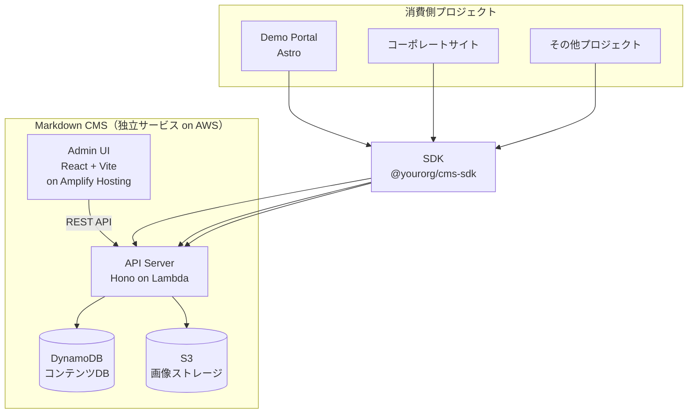
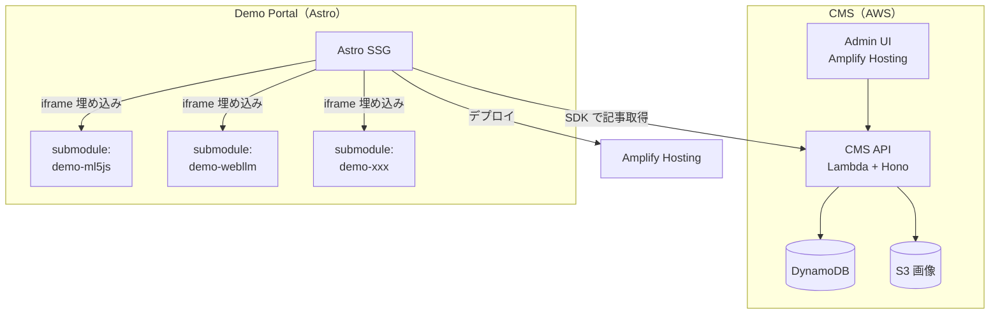

# 自前 Markdown CMS - 再利用可能な軽量コンテンツ管理

## 仮説

Hono + DynamoDB + S3 で軽量な Markdown CMS を自前構築すれば、デモポータルだけでなく社内の様々なプロジェクトで再利用できる汎用サービスになる。

## 評価基準

| 指標 | 目標値 | 現在値 |
|------|--------|--------|
| API レスポンス | < 200ms | - |
| 画像アップロード | < 3秒 (5MB以下) | - |
| MVP 完成 | 2-3日 | - |
| 他プロジェクトで再利用 | SDK 導入のみで使える | - |

**成功条件**: Markdown 記事の CRUD + 画像アップロード + SDK 経由での取得が動くこと

**失敗条件**: AWS の設定が複雑すぎて運用コストが見合わない

## 背景・動機

デモポータルサイトの設計過程で、以下の要件が浮上:

- デモは Web コンテンツだけでなく、動画（VisionOS 等）や技術記事も含む
- エンジニアが Markdown でコンテンツ管理したい
- リッチエディタは不要。画像アップロードと YouTube/Vimeo 埋め込みがあれば十分
- 一度作れば他プロジェクトでも使い回したい
- 会社で AWS 契約済み

## リサーチ

### 全体アーキテクチャ



### AWS 構成

| レイヤー | AWSサービス | 用途 | 月額目安 |
|----------|------------|------|---------|
| **API** | Lambda + API Gateway | Hono API サーバー | ~$0（無料枠内） |
| **DB** | DynamoDB | 記事メタデータ + Markdown 本文 | ~$0（25GB無料） |
| **Storage** | S3 | 画像アップロード先 | ~$0.023/GB |
| **CDN** | CloudFront | S3 画像配信 + API キャッシュ | ~$0（1TB無料） |
| **Auth** | Cognito（or JWT自前） | 管理画面ログイン | ~$0（50K MAU無料） |
| **Hosting** | Amplify Hosting | Admin UI + Demo Portal | ~$0（ビルド1000分/月無料） |

→ 小規模なら **ほぼ無料** で運用可能

### リポジトリ構成

```
markdown-cms/
├── pnpm-workspace.yaml
├── packages/
│   ├── api/                      # Hono API（Lambda デプロイ）
│   │   ├── src/
│   │   │   ├── index.ts          # エントリポイント
│   │   │   ├── routes/
│   │   │   │   ├── posts.ts      # 記事 CRUD
│   │   │   │   ├── media.ts      # 画像アップロード
│   │   │   │   └── auth.ts       # 認証
│   │   │   ├── db/
│   │   │   │   └── dynamo.ts     # DynamoDB 操作
│   │   │   └── storage/
│   │   │       └── s3.ts         # S3 操作
│   │   ├── serverless.yml        # Lambda デプロイ設定（SST or SAM）
│   │   └── package.json
│   │
│   ├── admin/                    # 管理画面（React + Vite）
│   │   ├── src/
│   │   │   ├── pages/
│   │   │   │   ├── Login.tsx
│   │   │   │   ├── PostList.tsx
│   │   │   │   └── PostEditor.tsx
│   │   │   └── components/
│   │   │       ├── MarkdownEditor.tsx    # textarea + live preview
│   │   │       ├── ImageUploader.tsx     # D&D → S3 presigned URL
│   │   │       └── VideoEmbed.tsx        # YouTube/Vimeo プレビュー
│   │   └── package.json
│   │
│   └── sdk/                      # クライアント SDK
│       ├── src/
│       │   ├── index.ts
│       │   ├── client.ts         # API クライアント
│       │   └── types.ts          # 型定義
│       └── package.json
```

### API 設計

```
認証
  POST   /api/auth/login              → JWT 発行

記事
  GET    /api/posts                    → 一覧（?status=published&tag=ML）
  GET    /api/posts/:slug             → 1件取得（Markdown 本文含む）
  POST   /api/posts                    → 新規作成
  PUT    /api/posts/:slug             → 更新
  DELETE /api/posts/:slug             → 削除

メディア
  POST   /api/media/upload            → S3 presigned URL 発行
  GET    /api/media                    → アップ済み一覧
  DELETE /api/media/:id               → 削除
```

### DynamoDB テーブル設計

```
Table: cms-posts
  PK: slug (String)
  Attributes:
    - title        (String)
    - type         (String)    # web-demo | video | article | mixed
    - tags         (List)      # ["ML", "VisionOS"]
    - techStack    (List)      # ["ml5.js", "TypeScript"]
    - markdown     (String)    # 本文（Markdown 生テキスト）
    - thumbnail    (String)    # S3 URL
    - demoUrl      (String)    # iframe 用 URL
    - repoUrl      (String)    # GitHub URL
    - videoUrl     (String)    # YouTube/Vimeo URL
    - embedMode    (String)    # iframe | link | none
    - status       (String)    # draft | published
    - createdAt    (String)    # ISO 8601
    - updatedAt    (String)    # ISO 8601

  GSI: status-createdAt-index
    PK: status, SK: createdAt  # 公開済み記事を日付順で取得

Table: cms-media
  PK: id (String)
  Attributes:
    - filename     (String)
    - url          (String)    # S3 URL
    - size         (Number)    # bytes
    - mimeType     (String)
    - createdAt    (String)
```

### SDK の使い方

```typescript
import { CmsClient } from '@yourorg/markdown-cms-sdk';

const cms = new CmsClient({
  apiUrl: 'https://xxx.execute-api.ap-northeast-1.amazonaws.com',
  apiKey: 'your-api-key',
});

// Demo Portal (Astro) で一覧取得
const posts = await cms.posts.list({
  status: 'published',
  tag: 'ML',
});

// 1件取得
const post = await cms.posts.get('ml5js-pose-detection');
// → { title, markdown, thumbnail, demoUrl, videoUrl, tags, ... }
```

### 管理画面の機能

```
┌──────────────────────────────────────────────────────┐
│ Markdown CMS Admin                          [Logout] │
├──────────────────────────────────────────────────────┤
│                                                      │
│ Post Editor                     [Save Draft] [Publish]│
│                                                      │
│ Title: [VisionOS 空間UIの実装            ]            │
│ Slug:  [visionos-spatial-ui              ]  [Auto]   │
│ Type:  [video ▾]   Tags: [VisionOS] [Swift] [+ Add] │
│ Video: [https://youtube.com/watch?v=xxx  ]           │
│                                                      │
│ ┌──── Edit ────────────┐ ┌──── Preview ──────────┐  │
│ │                      │ │                        │  │
│ │ ## 概要              │ │ <h2>概要</h2>          │  │
│ │                      │ │                        │  │
│ │ VisionOS で空間UI    │ │ VisionOS で空間UIを    │  │
│ │ を実装したデモ。     │ │ 実装したデモ。         │  │
│ │                      │ │                        │  │
│ │    │ │ [画像プレビュー]       │  │
│ │                      │ │                        │  │
│ └──────────────────────┘ └────────────────────────┘  │
│                                                      │
│ 📎 Images          [Drop or Click to Upload]         │
│  ┌──────┐ ┌──────┐                                   │
│  │      │ │      │  ← クリックで  挿入       │
│  │thumb │ │arch  │                                    │
│  └──────┘ └──────┘                                   │
└──────────────────────────────────────────────────────┘
```

**機能一覧:**
- Markdown テキストエリア + リアルタイムプレビュー（左右分割）
- 画像ドラッグ&ドロップ → S3 アップロード → `` 自動挿入
- YouTube/Vimeo URL 入力 → プレビュー表示
- タグ管理（自由入力 + サジェスト）
- 下書き / 公開 ステータス管理
- 記事一覧（フィルター・検索）

### 全体の関係図: Demo Portal + CMS + 各デモ



### 開発ステップ

| Step | 内容 | 目安 |
|------|------|------|
| 1 | API: 記事 CRUD + DynamoDB | 0.5日 |
| 2 | API: S3 画像アップロード（presigned URL） | 0.5日 |
| 3 | Admin: ログイン + 記事一覧 | 0.5日 |
| 4 | Admin: Markdown エディタ + プレビュー | 0.5日 |
| 5 | Admin: 画像アップロード UI | 0.5日 |
| 6 | SDK: クライアントパッケージ | 0.5日 |
| 7 | Demo Portal: Astro + SDK 連携 | 0.5日 |

→ **MVP: 約3日**

### 参考技術

- [Hono on AWS Lambda](https://hono.dev/docs/getting-started/aws-lambda)
- [SST (Serverless Stack)](https://sst.dev/) - Lambda + DynamoDB + S3 を TypeScript で IaC
- [Amplify Gen 2](https://docs.amplify.aws/gen2/)
- [S3 Presigned URL](https://docs.aws.amazon.com/AmazonS3/latest/userguide/PresignedUrlUploadObject.html)
- [react-markdown](https://github.com/remarkjs/react-markdown) - プレビュー用

## 実験ログ

_(実験開始後にログを追記)_

## 結論

_(実験完了後に記載)_
